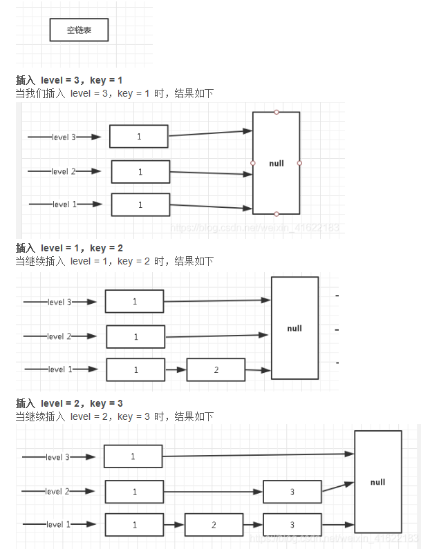

# Redis
redis本质是一个数据库，只不过数据是存在内存中，所以读写速度很快。因此也被广泛应用于缓存，也经常用来做分布式锁等。
## redis线程模型
redis内部使用文件事件处理器file event handler，这个文件事件处理器是单线程的。它采用IO多路复用机制同时监听多个socket，根据socket上的事件来选择对应的事件处理器处理。  
文件事件处理器结构：
* 多个socket
* IO多路复用程序
* 文件事件分派器
* 事件处理器（连接应答处理器、命令请求处理器、命令回复处理器）
> 多个socket可能会并发产生不同的操作，每个操作对应不同的文件事件，但是IO多路复用程序会监控多个socket，会将socket产生的事件放入队列中排队，事件分派器每次从队列中取出一个事件，把该事件交给对应的事件处理器处理。

## 缓存中的结构
字符串（SDS动态字符串）、列表（双端链表、压缩链表）、哈希表（压缩链表、字典）、集合set（字典）、有序集合zset（压缩链表、跳跃表）
* string字符串：最基础数据结构类型，是二进制安全的，可存储图片或序列化对象，值最大存储512M；
* hash哈希：指value本身又是一个键值对结构，
* list列表：存储多个有序的字符串，最多可存储2^32-1个元素。
* set集合：保存多个字符串元素，但是不能重复。
* zset有序集合：排序的字符串集合，且元素不重复。
### sorted set
ziplist(压缩链表)、skiplsit(跳跃表)  
当zset：成员数量小于128个、每个member的字符串长度都小于64个字节使用压缩链表。
#### skiplist
跳跃表是一种有序的数据结构，它通过在每个节点中维护多个指向其他节点的指针，从而达到快速访问队尾的目的。跳跃表的效率可以和平衡树媲美，最关键在于其实现相对于平衡树来说，代码的实现上简单。  
跳跃表在redis中使用，一是实现有序集合键，二是集群节点中用作内部数据结构。  
##### level定义
跳跃表的level层级完全是随机的，一般层级越多，访问节点的速度越快。
##### 插入
层级随机，每个层级最末端节点指向都是null，表示该层级到达末尾，可以跳向下一级。新插入一个节点不会影响其他节点的层数。如一个节点随机的层数是3，那么就将它链入到第1层到第3层这三层链表中。

##### 查询
跳跃表的查询是从顶层往下找，那么会先从第一层顶层开始找，通过循环比较，如果顶层节点的下一个节点为空说明到达末尾，跳到第2层，继续遍历，直到找到对应节点。  
在跳到下一层遍历时，不是重新遍历，而是从当前这个节点继续往下找下一个节点。

实际应用中skiplist每个节点应该包含key和value两部分。实际上列表中是按照key进行排序的，查找过程也是根据key在比较。平均时间复杂的O(log n)。
##### skiplist和平衡树、哈希表比较
* skiplist和各种平衡树（如红黑树等）的元素是有序排列的，而哈希表不是有序的。因此在哈希表上只能做单个key的查找，不适宜做范围查找。所谓范围查找指的是查找那些大小在指定的两个值之间的所有节点。
* 在做范围查找的时候，平衡树比skiplist操作复杂。在平衡树上，找到指定范围的小值之后，还需要以中序遍历的顺序继续查找其他不超过大值的节点。如果不对平衡树进行一定改造，其中的中序遍历并不容易实现。而skiplist进行范围查找比较简单，只需要在找到小值之后，对第1层链表进行若干步遍历就可实现。
* 平衡树的插入和删除操作可能引发子树的调整，逻辑复杂，而skiplist只需修改相邻节点的指针。
* 内存占用上来看，skiplist比平衡树更灵活。平衡树每个节点包含2个指针（分别指向左右子树），而skiplist每个节点包含的指针数目平均为1/(1-p)，具体取决于参数p的大小。如果像Redis里的实现一样，取p=1/4，那么平均每个节点包含1.33个指针，比平衡树更有优势。
* 查找单个key，skiplist和平衡树的时间复杂度都为O(log n)，大体相当；而哈希表在保持较低的哈希值冲突概率的前提下，查找时间复杂度接近O(1)，性能更高一些。所以我们平常使用的各种Map或dictionary结构，大都是基于哈希表实现的。

## redis缓存问题
### redis hash冲突
redis作为一个K-V的内存数据库，使用一张全局的哈希来保存所有的键值对。这张哈希表，由多个哈希桶组成，哈希桶中的entry元素保存了key和value指针，其中key指向了实际的键，value指向实际的值。  
哈希表查找速率快，类似于HashMap，在O(1)的时间复杂度快速找到键值对。首先通过key计算hash值，找到对应的哈希桶位置，然后定位到entry，在entry找到对应的数据。
#### 什么是hash冲突
通过不同的key计算出一样的hash值，导致落在同一个哈希桶中。
#### 解决
redis为了解决hash冲突，采用了链式哈希。链式哈希是指同一个哈希桶中，多个元素用一个链表来保存，它们之间依次用指针链接。
> 哈希冲突链上的元素只能通过指针逐一查找再操作。当往哈希表插入数据很多，冲突也会越多，冲突链表就会越长，那查询效率就会降低。
> 为了保持高效，redis会对哈希表做rehash操作，也就是增加哈希桶，减少冲突。为了rehash更高效，redis还默认使用了两个全局哈希表，一个用于当前，称为主哈希表，一个用于扩容，称为备用哈希表。
### 在生成RDB期间，redis可以同时处理写请求吗
可以，redis提供两个指令生成RDB，save和bgsave。
* 如果是save指令，会阻塞，主线程执行；
* 如果是bgsave，是fork一个子进程来写入RDB文件的，快照持久化完全交给子进程处理，父进程可以继续处理客户端的请求。
### 缓存雪崩
缓存在同一时间大面积的失效，导致后面的请求都到了数据库，造成数据库短时间内承受大量请求从而出现数据库崩掉最终导致整个系统崩坏。
* 尽量保证整个redis集群高可用性，发现宕机及时补上，并且选择合适的内存淘汰策略；均匀设置过期时间，使其相对分散。
* 本地进行cache缓存，并且采用hystrix限流降级，避免数据库挂掉；
* 利用redis持久化机制保存的数据尽快恢复；
### 缓存穿透
大量请求的key不存在于缓存中，导致请求直接到了数据库上，根本没有经过缓存，从而给数据库带来压力。
* 做好参数校验，不合法请求直接抛出异常给前端；
* 缓存无效的key，缓存和数据库都查不到某个key的数据就写一个空值到数据库并设置过期时间。这种方式可以解决请求变化不频繁的情况，如果是黑客恶意攻击则会导致redis缓存大量无效的key。
* 布隆过滤器：快速判断一个给定数据是否存在于海量数据中。

## redis底层使用的协议
RESP：redis serialization protocol，是专门为redis设计的一套序列化协议，这个协议其实在redis的1.2版本就已经出现了，但是到2.0最终成为redis通讯协议的标准。主要是实现简单、解析速度快、可读性好。
## redis持久化
RDB和AOF，redis默认使用RDB快照。
### AOF持久化
数据一致性和完整性高，秒级数据丢失。但是相同的数据集，AOF文件体积大于RDB，数据恢复也慢。  
AOF(append only file)采用日志的形式来记录每个写操作，追加到AOF文件末尾。redis默认是不开启AOF的。重启时再重新执行AOF文件中的命令来恢复数据。主要解决数据持久化的实时性问题。  
AOF是执行完命令后才记录日志的，redis在向AOF记录日志时，不会先对这些命令进行语法检查，如果先记录日志再执行命令，日志中可能记录了错误命令，redis使用日志恢复数据可能会出错。执行完命令再记录日志不会阻塞当前的写操作，但是会存在：a-执行完命令还没有记录日志宕机导致数据丢失；b-AOF不会阻塞当前命令但是可能会阻塞下一个操作。  
解决方案是AOF机制的三种写回策略 append file sync
* always：同步写回，每个子命令执行完都立即将日志写回磁盘；可以基本保证数据不丢失
* everysec：每个命令执行完，只是先把日志写到AOF内容缓冲区，每隔一秒同步到磁盘；
* no：只是先把日志写到内存缓冲区，由操作系统决定何时写入磁盘。性能高
> 日志文件过大：AOF重写机制，随着时间推移，AOF会有一些冗余命令如无效命令、过期数据的命令等，AOF重写机制就是将它们合并为一个命令(类似批处理命令)，从而达到精简压缩空间的目的。AOF日志是由主线程写的。重写由后台子进程bgrewriteaof完成。
### RDB持久化
就是把内存数据以快照的形式保存到磁盘上。与AOF相比，记录的是某一时刻的数据，并不是操作。  
RDB持久化是指在指定的时间间隔内，执行指定次数的写操作，将内存中的数据集快照写入到磁盘中，它是redis默认的持久化方式。执行完操作后，在指定目录下会生成一个dump.rdb文件，redis重启的时候通过加载该文件来恢复数据。  
RDB触发机制：
* 手动触发：save-同步，会阻塞当前线程；bgsave-异步，redis进程fork操作创建子进程；
* 自动触发：save m n-m秒内数据集存在n次修改时自动触发bgsave。

快照时数据可以修改，redis借助操作系统的写时复制技术(copy-on-write COW)，在执行快照时正常处理写操作。  
虽然bgsave不会阻塞主线程但是频繁执行全量快照也会带来性能开销。bgsave子进程需要通过fork操作从主线程创建出来，创建后不会阻塞主线程，但是创建的过程会阻塞主线程。可以做增量快照。  
> 恢复大数据集更快，适合大规模数据恢复场景，如备份、全量复制等。但是没办法做到实时持久化/秒级持久化。

redis4.0开始支持RDB和AOF混合持久化，就是内存快照以一定频率执行，两次快照之间再使用AOF记录这段时间内的所有命令操作。
## redis主从同步
redis主从同步包括三个阶段：  
第一阶段：主从库建立连、协商同步；
* 从库向主库发送psync命令，告诉主库要进行数据同步；
* 主库收到psync命令后，响应FULLRESYNC命令(表示第一次复制采用全量复制)，并带上主库runID和主库目前的复制进度offset。  

第二阶段：主库把数据同步到从库，从库收到数据后完成本地加载
* 主库执行bgsave命令生成RDB文件，接着将文件发给从库，从库接收到文件后，会先清空当前数据库，然后加载RDB文件；
* 主库把数据同步到从库的过程中，新来的写操作会记录到replication buffer。

第三阶段，主库把新写的命令发送到从库
* 主库完成RDB发送后，会把replication buffer中的修改操作发送给从库，从库再重新执行这些操作。
## redis过期策略
定时过期、惰性过期、定期过期
* 定时过期：每个设置过期时间的key都需要创建一个 定时器，到过期时间就会立即对key进行清楚。该策略可以立即清楚过期的数据，对内存友好，但是会占用大量的CPU资源去处理过期数据，从而影响缓存的响应时间和吞吐量。
* 惰性过期：只有当访问一个key时才会判断是否已过期，过期则清楚。该策略可以最大化的节省CPU资源，却对内存不友好。极端情况可能出现大量的key没有再次被访问，从而不会清除，占用大量内存。
* 定期过期：每隔一定时间扫描一定数量的数据库expires字典中一定数量的key，并清除其中已过期的key。该策略是前两者中的一个折中方案，通过调整定时扫描的时间间隔和每次扫描的限定耗时，可以在不同情况下是得CPU和内存资源达到最优的平衡效果。

expires字典会保存所有设置了过期时间的key的过期时间数据，其中key是指向键空间中的某个键的指针，value是该键的毫秒精度的Unix时间戳表示的过期时间。键空间是redis集群中保存的所有键。  
redis同时使用了惰性过期和定期过期两种策略：
* 假设redi当前存了30万个key，并且都设置了过期时间，如果每隔100ms就去检查全部key，CPU负载会很高，最后可能挂掉；
* 因此redis采用定期过期，每个100ms随机抽取一定数量的key来检查和删除；
* 同时，最后可能有很多已过期的key没被删除，这时，redis采用惰性删除，在获取某个key时检查一下，如果设置了过期时间且已过期就删除掉。
> 如果定期删除漏掉很多过期key，同时这些key也大量没被访问到，就会有很多key堆积在内存，导致内存爆掉。这个需要内存淘汰策略来保障。
## redis内存淘汰策略
* volatile-lru：当内存不足以容纳新写入数据时，从设置了过期时间的key中使用LRU（最近最少使用）算法进行淘汰；
* allkeys-lru：当内存不足以容纳新写入内容时，从所有key中使用LRU（最不经常使用）进行淘汰；
* volatile-lfu：4.0版本新增，当内存不足以容纳新写入数据时，在过期key中使用LFU（使用频率最低）进行删除key；
* allkeys-lfu：4.0版本新增，当内存不足以容纳新写入数据时，在所有key中使用LFU（使用频率最低）进行删除key；
* volatile-random：当内存不足以容纳新写入数据时，从设置了过期时间的key中随机淘汰数据；
* allkeys-random：当内存不足以容纳新写入数据时，从所有key中随机淘汰数据；
* volatile-ttl：当内存不足以容纳新写入数据时，在设置了过期key中根据时间进行淘汰，越早过期（将要过期）优先被淘汰；
* noeviction：默认策略，当内存不足以写入新数据，新写入会报错。

## redis哨兵集群高可用
主从 哨兵
### redis哨兵机制
主从模式中，一旦主节点由于故障不能提供服务，需要人工将从节点晋升为主节点，同时还要通知应用方更新主节点地址。显然多数业务场景无法接受这种故障处理方式。redis2.8之后开始正是提供了Redis Sentinel架构来解决这个问题。  
哨兵模式：由一个或多个sentinel实例组成的sentinel系统，它可以监视所有的redis主从节点，并在被监视的主节点进入下线状态时自动将下线主服务器属下的某个从节点升级为主节点。但是一个哨兵进程对redis节点监控可能会出现问题（单点问题），因此使用多个哨兵来进行监控，并且各个哨兵之间还会进行监控。
* 发送命令，等待redis服务器（包括主服务器和从服务器）返回监控其运行状态；
* 哨兵监测到主节点宕机，会自动将从节点切换为主机点，然后通过发布订阅模式通知其他的从节点，修改配置文件，切换主机；
* 哨兵之间互相监控，达到高可用。
#### 哨兵的功能
* 集群监控：负责监控redis master和slave进程是否正常工作；
* 消息通知：如果redis实例有故障，那么哨兵负责发送消息作为报警通知给管理员；
* 故障转移：如果master node挂掉，会自动转移到salve node上；
* 配置中心：如果故障转移发生了，通知client客户端新的master地址；
#### 故障切换过程
假设主服务器宕机，哨兵1先检测到这个结果，系统不会马上进行failover过程，仅仅是哨兵1主观的认为主服务器不可用，这个现象称为主观下线。当后面的哨兵也检测到主服务器不可用，并且数量达到一定值，那么哨兵之间会进行一次投票，投票的结果由一个哨兵发起，进行failover操作。切换成功后，就会通过发布订阅模式，让各个哨兵把自己监控的从服务器实现切换主机，这个过程称之为客观下线。
#### 哨兵工作模式
1. 每个sentinel以每秒钟一次的频率向它所知的master、slave以及其他sentinel实例发送一个ping命令。
2. 如果一个实例（instance）距离最后一次有效回复ping命令的时间超过down-after-milliseconds选项所指定的值，则这个实例会被sentinel标记为主观下线。
3. 如果一个master被标记为主观下线，则正在监视这个master的所有sentinel要以每秒一次的频率确认master的确进入了主观下线状态。
4. 当有足够数量的sentinel（大于等于配置文件指定的值）在指定时间范围内确认master的确进入了主观下线状态，则master会被标记为客观下线。
5. 在一般情况下，每个sentinel会以每10秒一次的频率向它已知的所有master、salve发送info命令。
6. 当master被标记为客观下线，sentinel向下线的master的所有salve发送info命令的频率会从10秒一次改为1秒一次。
7. 若没有足够数量的sentinel同意master已经下线，master的客观下线状态就会被移除；若master重新向sentinel的ping命令返回有效回复，master的主观下线状态会被移除。
#### 哨兵集群自动发现机制
哨兵之间的发现，是通过redis的pub/sub系统实现的，每个哨兵会往__sentinel__:hello这个通道里发送一个消息，这时候所有其他哨兵都可以消费到这个消息，并感知到其他哨兵的存在。  
每隔两秒钟，每个哨兵都会往自己监控的某个master-slave对应的__sentinel__:hello channel里发送一个消息，内容是自己的host、IP、runid和对这个master的监控配置。  
每个哨兵也会去监控自己监控的每个master+slaves 对应的__sentinel__:hello channel，去感知同样在监听这个master+slaves的其他哨兵的存在。  
每个哨兵还会跟其他哨兵交换对master的监控配置，互相进行监控配置的同步。
#### slave配置自动纠正
哨兵会负责自动纠正slave一些配置，比如slave如果要成为潜在的master候选，哨兵会确保slave复制现有的master数据，如果slave连接到一个错误的master上，比如故障转移之后，那么哨兵会确保它们连接到正确的master上。
#### 哨兵主备切换数据丢失问题
* 异步复制导致数据丢失：master->slave的复制是异步的，可能有部分数据还没复制到slave，master就宕机了，那么这部分数据就丢失 了；
* 脑裂导致数据丢失：脑裂，也就是说某个master所在机器突然脱离了正常网络，跟其他的slave机器不能连接，但实际上master还在运行。此时哨兵可能认为master宕机了，开启选举，将其他slave切换成master。此时集群就会有两个master。此时虽然某个slave切换为了master，但可能client还没来得及切换到新master，继续向旧master写数据。旧master再次恢复恢复时，会被作为一个slave挂到新master上，自己数据会被清空，重新从新master复制数据。此时新master没有后来client写入的数据，这部分数据丢失了。
#### 数据丢失解决方案
min-slaves-to-write 1 / min-slaves-max-lag 10：表示至少有一个slave，数据复制和同步的延迟不能超过10秒。  
如果说一旦所有的slave，数据复制和同步的延迟都超过了10秒钟，那么这个时候，master就不会再接收任何请求。
* 减少异步复制丢失的数据： min-slaves-max-lag的配置，可以确保一旦slave复制数据和ack延时太长，就认为可能master宕机后损失的数据太多了，那么就拒绝写请求，这样可以把宕机延时部分数据未同步到salve导致的数据丢失降低到可控范围内。
* 减少脑裂数据丢失：如果一个master出现了脑裂，跟其他的slave丢失了连接，那么以上两个配置可以确保如果不能继续给指定数量的slave发送数据，而且slave超过10秒没给自己ack消息，那么就直接拒绝客户端的写请求，此场景下最多丢失10秒数据。
## redis cluster
在Redis Cluster架构下，每个redis要放开两个端口号，比如一个是6379，另外一个就是加1w的端口号，比如16379。  
16379端口号是用来进行节点间通信的，也就是cluster bus的东西，cluster bus的通信用来进行故障检测、配置更新、故障转移授权。cluster bus用了另外一种二进制的协议，gossip协议，用于节点间进行高效的数据交换，占用更少的网络带宽和处理时间。
* 自动将数据进行分片，每个cluster上放一部分数据；
* 提供内置的高可用支持，部分master不可用时，还是可以继续工作。
### 节点间的内部通信机制
#### 基本通信原理
集群元数据的维护有两种方式：集中式、gossip协议。redis cluster节点采用gossip协议进行通信。  
集中式是将集群元数据（节点信息、故障等等）集中存储在某几个节点上。集中式 元数据集中存储的一个典型代表就是大数据领域的storm。它是分布式的大数据实时计算引擎，是集中式的元数据存储的结构，底层基于zookeeper对所有的元数据进行存储维护。  
gossip协议，redis维护集群元数据的另一个方式，所有的节点都持有一份元数据，不同的节点如果出现元数据的变更，就不断的将元数据发送给其他节点，让其他节点也进行元数据的变更。  
集中式的好处在于元数据的读取和更新时效性很好，一旦元数据出现变更，就立即更新到集中式存储中，其他节点读取的时候就可以感知到；但是所有的元数据更新压力都集中在一个地方，可能会导致元数据的存储有压力。  
gossip协议好处在于元数据更新比较分散，不是集中在一个地方，更新请求会陆陆续续打到所有节点上去更新，降低了压力。但是元数据更新有延时，可能会导致集群中一些操作滞后。
* 10000端口：每个节点都有一个专门用于节点间通信的端口，就是自己提供服务的端口号+10000。每个节点每隔一段时间都会往另外几个节点发送ping消息，同时其他几个节点接收到ping之后返回pong。
* 交换的信息：信息包括故障信息、节点间的增加和删除、hash slot信息等。
##### gossip协议
gossip协议包含多种信息，包括ping、pong、meet、fail等。
* meet：某个节点发送meet给新加入的节点，让新节点加入到集群中，然后新节点就会开始于其他节点进行通信；
* ping：每个节点都会频繁给其他节点发送ping，其中包含自己的状态还有自己维护的集群元数据，互相通过ping交换元数据；
* pong：返回ping和meet，包含自己的状态和其他信息，也用于信息广播和更新；
* fail：某个节点判断另一个节点fail之后，就会发送fail给其他节点，通知其他节点，某个节点挂掉了。
##### ping消息深入
ping时会携带一些元数据，如果很频繁，可能会加重网络负担。  
每个节点每秒会执行10次ping，每次会选择5个最久没有通信的其他节点。当然如果发现某个节点通信延时达到了cluster_node_timeout / 2，那么立即发送ping，避免数据交换延时过长。比如两个节点之间10分钟没有交换数据，那么整个集群处于严重的元数据不一致情况，就会有问题。所以cluster_node_timeout可调节，若该值较大，会降低ping频率。  
每次ping会带上自己的节点信息，还有就是带上1/10其他节点信息，发送出去，进行交换。至少包含3个节点的信息，最多包含总结点数-2的其他节点信息。
### Redis Cluster高可用与主备切换原理
Redis Cluster的高可用原理，与哨兵是类似的。
#### 判断节点宕机
如果一个节点认为另外一个节点宕机，那么就是pfail，主观宕机。如果多个节点都认为另外一个节点宕机了，那么就是fail，客观宕机，sdown、odown。  
在cluster-node-timeout内，某个节点一直没有返回pong，那么就认为是pfail。  
如果一个节点认为某个节点pfail了，那么会在gossip ping消息中，ping给其他节点，如果超过半数节点都认为pfail了，那么就会变为fail。
#### 从节点过滤
对宕机的master node，从其所有的slave node中选择一个切换为master node。  
检查每个salve node与master node断开连接的时间，如果超过了cluster-node-timeout*cluster-slave-validity-factor，那么就没有资格切换为master。
#### 从节点选举
每个从节点都根据自己对master复制数据的offset来设置一个选举时间，offset越大（复制数据越多）的从节点，选举时间越靠前，优先进行选举。  
所有的master node开始salve选举投票，给要选举的slave进行投票，如果大部分master node都投票给了某个从节点，那么选举通过，那个从节点可以切换为master，从节点执行主备切换，从节点切换为主节点。
## redis 分布式锁
分布式锁是控制分布式系统不同进程共同访问共享资源的一种锁的实现。通常使用redis作为分布式锁。一般有以下集中实现：
* 命令setnx +expire分开写
* setnx + value值是过期时间
* set的扩展命令（set ex px nx）
* set ex px nx + 校验唯一随机值，再删除
### 命令setnx +expire分开写
如果执行完setnx加锁，正要执行expire设置过期时间时，进程crush掉或者需要重启维护，那么这个锁就永远无法得到释放，别的线程再也获取不到，所以分布式锁无法使用这种方式实现。
### setnx + value 值是过期时间
设置value值是过期时间，对过期时间进行比较。缺点是：过期时间是客户端自己生成的，分布式环境下每个客户端时间必须同步；没有保存保持者的唯一标识，可能会被其他客户端释放/解锁；锁过期的时候并发多个客户端都请求过来，都执行jedis.getSet()最终只有一个成功，但是锁的过期时间可能被别的客户端覆盖。
###  set 的扩展命令（set ex px nx）
原子操作，保证只有一个客户端能够获取锁。缺点：锁过期释放了，业务还没执行完；存在锁被别的线程误删。
### set ex px nx + 校验唯一随机值,再删除
会判断当前线程加的锁和释放的锁是不是一个原子操作，即当前线程加的锁才释放。如果调用jedis.del()释放锁的时候，可能这把锁已经不属于当前客户端，会解除他人加的锁。一般使用lua脚本代替。但是仍然可能存在锁过期释放了，业务还没执行完的情况。
### Redisson分布式锁
会给获得锁的线程，开启一个定时守护线程，每隔一段时间检查锁是否还存在，存在则对锁的过期时间延长，防止锁过期提前释放。  
只要线程1加锁成功，就会启动一个watch dog看门狗，是一个后台线程，会每隔10秒检查下，若线程1还持有锁，那么就会不断延长锁key的生存时间。
### RedLock算法
redis一般是集群部署，假设数据在主从同步过程，主节点挂了，redis分布式锁可能会出现其他线程获取同个key的锁，但第一个线程也已经拿到了锁，锁的安全性就没有了。  
RedLock的核心思想：多个redis master部署，保证它们不会同时宕掉，并且这些master节点是完全相互独立的，相互之间不存在数据同步。同时需要确保在这多个master实例上，是在与redis单实例使用相同的方法来获取和释放锁。  
假设当前有个5个master节点5台服务器上运行实例，实现步骤如下：
1. 获取当前时间，以毫秒为单位；
2. 按顺序向五个master节点请求加锁。客户端设置网络连接时间和响应超时时间，并且超时时间要小于锁的失效时间。（假设锁的自动失效时间为10秒，则超时时间一般在5-50毫秒，假设超时时间为50ms），如果超时，跳过该节点，尽快尝试下个节点；
3. 客户端使用当前时间减去开始获取锁时间（即步骤1记录的时间），得到获取锁使用的时间。当且仅当超过一半的master节点都获得锁，并且使用时间小于锁失效时间时，锁才算获取成功。
4. 如果取到了锁，key的真正有效时间就改变了，需要减去获取锁所使用的时间。
5. 如果获取锁失败，客户端要在所有的master节点上释放锁。

### 分布式寻址算法
* hash算法：大量缓存重建；
* 一致性hash算法（自动缓存迁移）+虚拟节点（自动负载均衡）；
* redis cluster的hash slot算法。
#### hash算法
来了一个key，首先计算hash值，然后对节点数据取模，打在不同的master节点上。一旦某一个master节点宕机，所有请求过来，都会基于最新的剩余master节点数去取模，尝试去取数据。这会导致大部分请求过来，全部无法拿到有效的缓存，导致大量的流量涌入数据库。
#### 一致性hash算法
一致性hash算法将整个hash值空间组织成一个虚拟的圆环，整个空间按顺时针方向组织，下一步将各个节点master节点（使用服务器的IP或主机名）进行hash。这样就能确定每个节点在其哈希环上的位置。  
来了一个key，首先计算hash值，并确定此数据在环上位置，从此位置沿环顺时针，遇到的第一个master节点就是key所在的位置。  
在一致性hash算法中，如果一个节点挂掉了，受影响的数据仅仅是此节点到环空间前一个节点（沿逆时针遇到的第一个节点）之间的数据，其他不受影响。增加一个节点同理。  
然而，一致性哈希算法在节点太少时，容易因为节点分布不均匀而造成缓存热点问题。为了解决这种热点问题，一致性哈希算法引入了虚拟节点机制，即对每一个节点计算多个hash，每个计算结果位置都放置一个虚拟节点。这样就实现了数据的均匀分布，负载均衡。
#### hash slot算法
Redis Cluster有固定的16384个hash slot，对每个key计算CRC16值，然后对16384取模，可以获取key对应的hash slot。  
Redis Cluster中每个master都会持有部分slot，比如有3个master，那么可能每个master持有5000多个hash slot。hash slot让node的增加和移除很简单，增加一个master，就将其他master的hash slot移动部分过去，减少一个master就将它的hash slot移动到其他master上。移动hash slot成本是非常低的，客户端的API可以对指定的数据，让它们走同一个hash slot，通过hash tag来实现。  
