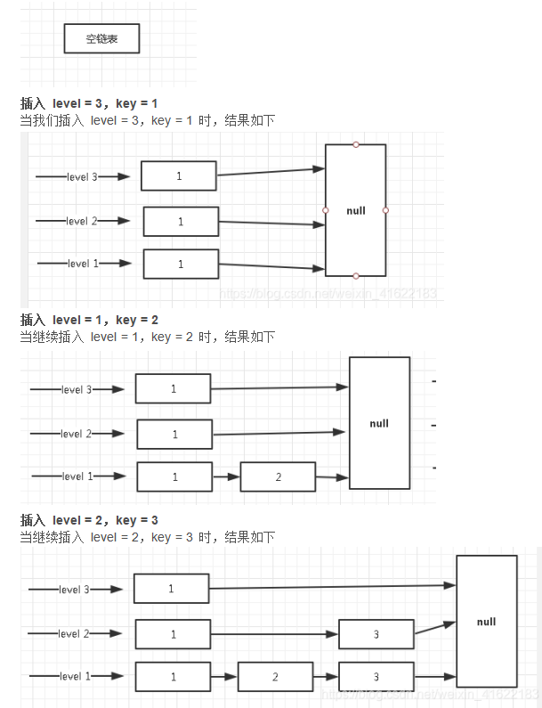
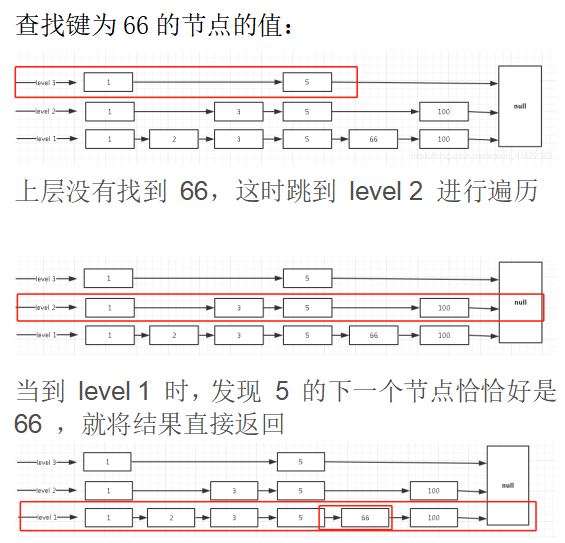

## 缓存中的结构
字符串（SDS动态字符串）、列表（双端链表、压缩链表）、哈希表（压缩链表、字典）、集合set（字典）、有序集合zset（压缩链表、跳跃表）
* string字符串：最基础数据结构类型，是二进制安全的，可存储图片或序列化对象，值最大存储512M；
* hash哈希：指value本身又是一个键值对结构，
* list列表：存储多个有序的字符串，最多可存储2^32-1个元素。
* set集合：保存多个字符串元素，但是不能重复。
* zset有序集合：排序的字符串集合，且元素不重复。
### sorted set
ziplist(压缩链表)、skiplsit(跳跃表)  
当zset：成员数量小于128个、每个member的字符串长度都小于64个字节使用压缩链表。
#### skiplist
跳跃表是一种有序的数据结构，它通过在每个节点中维护多个指向其他节点的指针，从而达到快速访问队尾的目的。跳跃表的效率可以和平衡树媲美，最关键在于其实现相对于平衡树来说，代码的实现上简单。  
跳跃表在redis中使用，一是实现有序集合键，二是集群节点中用作内部数据结构。  
##### level定义
跳跃表的level层级完全是随机的，一般层级越多，访问节点的速度越快。
##### 插入
层级随机，每个层级最末端节点指向都是null，表示该层级到达末尾，可以跳向下一级。新插入一个节点不会影响其他节点的层数。如一个节点随机的层数是3，那么就将它链入到第1层到第3层这三层链表中。

##### 查询
跳跃表的查询是从顶层往下找，那么会先从第一层顶层开始找，通过循环比较，如果顶层节点的下一个节点为空说明到达末尾，跳到第2层，继续遍历，直到找到对应节点。  
在跳到下一层遍历时，不是重新遍历，而是从当前这个节点继续往下找下一个节点。

实际应用中skiplist每个节点应该包含key和value两部分。实际上列表中是按照key进行排序的，查找过程也是根据key在比较。平均时间复杂的O(log n)。
##### skiplist和平衡树、哈希表比较
* skiplist和各种平衡树（如红黑树等）的元素是有序排列的，而哈希表不是有序的。因此在哈希表上只能做单个key的查找，不适宜做范围查找。所谓范围查找指的是查找那些大小在指定的两个值之间的所有节点。
* 在做范围查找的时候，平衡树比skiplist操作复杂。在平衡树上，找到指定范围的小值之后，还需要以中序遍历的顺序继续查找其他不超过大值的节点。如果不对平衡树进行一定改造，其中的中序遍历并不容易实现。而skiplist进行范围查找比较简单，只需要在找到小值之后，对第1层链表进行若干步遍历就可实现。
* 平衡树的插入和删除操作可能引发子树的调整，逻辑复杂，而skiplist只需修改相邻节点的指针。
* 内存占用上来看，skiplist比平衡树更灵活。平衡树每个节点包含2个指针（分别指向左右子树），而skiplist每个节点包含的指针数目平均为1/(1-p)，具体取决于参数p的大小。如果像Redis里的实现一样，取p=1/4，那么平均每个节点包含1.33个指针，比平衡树更有优势。
* 查找单个key，skiplist和平衡树的时间复杂度都为O(log n)，大体相当；而哈希表在保持较低的哈希值冲突概率的前提下，查找时间复杂度接近O(1)，性能更高一些。所以我们平常使用的各种Map或dictionary结构，大都是基于哈希表实现的。

## redis缓存问题
### redis hash冲突
redis作为一个K-V的内存数据库，使用一张全局的哈希来保存所有的键值对。这张哈希表，由多个哈希桶组成，哈希桶中的entry元素保存了key和value指针，其中key指向了实际的键，value指向实际的值。  
哈希表查找速率快，类似于HashMap，在O(1)的时间复杂度快速找到键值对。首先通过key计算hash值，找到对应的哈希桶位置，然后定位到entry，在entry找到对应的数据。
#### 什么是hash冲突
通过不同的key计算出一样的hash值，导致落在同一个哈希桶中。
#### 解决
redis为了解决hash冲突，采用了链式哈希。链式哈希是指同一个哈希桶中，多个元素用一个链表来保存，它们之间依次用指针链接。
> 哈希冲突链上的元素只能通过指针逐一查找再操作。当往哈希表插入数据很多，冲突也会越多，冲突链表就会越长，那查询效率就会降低。
> 为了保持高效，redis会对哈希表做rehash操作，也就是增加哈希桶，减少冲突。为了rehash更高效，redis还默认使用了两个全局哈希表，一个用于当前，称为主哈希表，一个用于扩容，称为备用哈希表。
### 在生成RDB期间，redis可以同时处理写请求吗
可以，redis提供两个指令生成RDB，save和bgsave。
* 如果是save指令，会阻塞，主线程执行；
* 如果是bgsave，是fork一个子进程来写入RDB文件的，快照持久化完全交给子进程处理，父进程可以继续处理客户端的请求。
### redis底层使用的协议
RESP：redis serialization protocol，是专门为redis设计的一套序列化协议，这个协议其实在redis的1.2版本就已经出现了，但是到2.0最终成为redis通讯协议的标准。主要是实现简单、解析速度快、可读性好。
### redis持久化
RDB和AOF
#### AOF持久化
数据一致性和完整性高，秒级数据丢失。但是相同的数据集，AOF文件体积大于RDB，数据恢复也慢。  
AOF(append only file)采用日志的形式来记录每个写操作，追加到AOF文件末尾。redis默认是不开启AOF的。重启时再重新执行AOF文件中的命令来恢复数据。主要解决数据持久化的实时性问题。  
AOF是执行完命令后才记录日志的，redis在向AOF记录日志时，不会先对这些命令进行语法检查，如果先记录日志再执行命令，日志中可能记录了错误命令，redis使用日志恢复数据可能会出错。执行完命令再记录日志不会阻塞当前的写操作，但是会存在：a-执行完命令还没有记录日志宕机导致数据丢失；b-AOF不会阻塞当前命令但是可能会阻塞下一个操作。  
解决方案是AOF机制的三种写回策略 append file sync
* always：同步写回，每个子命令执行完都立即将日志写回磁盘；可以基本保证数据不丢失
* everysec：每个命令执行完，只是先把日志写到AOF内容缓冲区，每隔一秒同步到磁盘；
* no：只是先把日志写到内存缓冲区，由操作系统决定何时写入磁盘。性能高
> 日志文件过大：AOF重写机制，随着时间推移，AOF会有一些冗余命令如无效命令、过期数据的命令等，AOF重写机制就是将它们合并为一个命令(类似批处理命令)，从而达到精简压缩空间的目的。AOF日志是由主线程写的。重写由后台子进程bgrewriteaof完成。
#### RDB持久化
就是把内存数据以快照的形式保存到磁盘上。与AOF相比，记录的是某一时刻的数据，并不是操作。  
RDB持久化是指在指定的时间间隔内，执行指定次数的写操作，将内存中的数据集快照写入到磁盘中，它是redis默认的持久化方式。执行完操作后，在指定目录下会生成一个dump.rdb文件，redis重启的时候通过加载该文件来恢复数据。  
RDB触发机制：
* 手动触发：save-同步，会阻塞当前线程；bgsave-异步，redis进程fork操作创建子进程；
* 自动触发：save m n-m秒内数据集存在n次修改时自动触发bgsave。

快照时数据可以修改，redis借助操作系统的写时复制技术(copy-on-write COW)，在执行快照时正常处理写操作。  
虽然bgsave不会阻塞主线程但是频繁执行全量快照也会带来性能开销。bgsave子进程需要通过fork操作从主线程创建出来，创建后不会阻塞主线程，但是创建的过程会阻塞主线程。可以做增量快照。  
> 恢复大数据集更快，适合大规模数据恢复场景，如备份、全量复制等。但是没办法做到实时持久化/秒级持久化。

redis4.0开始支持RDB和AOF混合持久化，就是内存快照以一定频率执行，两次快照之间再使用AOF记录这段时间内的所有命令操作。
### redis主从同步
redis主从同步包括三个阶段：  
第一阶段：主从库建立连、协商同步；
* 从库向主库发送psync命令，告诉主库要进行数据同步；
* 主库收到psync命令后，响应FULLRESYNC命令(表示第一次复制采用全量复制)，并带上主库runID和主库目前的复制进度offset。  

第二阶段：主库把数据同步到从库，从库收到数据后完成本地加载
* 主库执行bgsave命令生成RDB文件，接着将文件发给从库，从库接收到文件后，会先清空当前数据库，然后加载RDB文件；
* 主库把数据同步到从库的过程中，新来的写操作会记录到replication buffer。

第三阶段，主库把新写的命令发送到从库
* 主库完成RDB发送后，会把replication buffer中的修改操作发送给从库，从库再重新执行这些操作。
### redis过期策略
定时过期、惰性过期、定期过期
* 定时过期：每个设置过期时间的key都需要创建一个 定时器，到过期时间就会立即对key进行清楚。该策略可以立即清楚过期的数据，对内存友好，但是会占用大量的CPU资源去处理过期数据，从而影响缓存的响应时间和吞吐量。
* 惰性过期：只有当访问一个key时才会判断是否已过期，过期则清楚。该策略可以最大化的节省CPU资源，却对内存不友好。极端情况可能出现大量的key没有再次被访问，从而不会清除，占用大量内存。
* 定期过期：每隔一定时间扫描一定数量的数据库expires字典中一定数量的key，并清除其中已过期的key。该策略是前两者中的一个折中方案，通过调整定时扫描的时间间隔和每次扫描的限定耗时，可以在不同情况下是得CPU和内存资源达到最优的平衡效果。

expires字典会保存所有设置了过期时间的key的过期时间数据，其中key是指向键空间中的某个键的指针，value是该键的毫秒精度的Unix时间戳表示的过期时间。键空间是redis集群中保存的所有键。  
redis同时使用了惰性过期和定期过期两种策略：
* 假设redi当前存了30万个key，并且都设置了过期时间，如果每隔100ms就去检查全部key，CPU负载会很高，最后可能挂掉；
* 因此redis采用定期过期，每个100ms随机抽取一定数量的key来检查和删除；
* 同时，最后可能有很多已过期的key没被删除，这时，redis采用惰性删除，在获取某个key时检查一下，如果设置了过期时间且已过期就删除掉。
> 如果定期删除漏掉很多过期key，同时这些key也大量没被访问到，就会有很多key堆积在内存，导致内存爆掉。这个需要内存淘汰策略来保障。
### redis内存淘汰策略
* volatile-lru：当内存不足以容纳新写入数据时，从设置了过期时间的key中使用LRU（最近最少使用）算法进行淘汰；
* allkeys-lru：当内存不足以容纳新写入内容时，从所有key中使用LRU进行淘汰；
* volatile-lfu：4.0版本新增，当内存不足以容纳新写入数据时，在过期key中使用LFU（使用频率最低）进行删除key；
* allkeys-lfu：4.0版本新增，当内存不足以容纳新写入数据时，在所有key中使用LFU（使用频率最低）进行删除key；
* volatile-random：当内存不足以容纳新写入数据时，从设置了过期时间的key中随机淘汰数据；
* allkeys-random：当内存不足以容纳新写入数据时，从所有key中随机淘汰数据；
* volatile-ttl：当内存不足以容纳新写入数据时，在设置了过期key中根据时间进行淘汰，越早过期优先被淘汰；
* noeviction：默认策略，当内存不足以写入新数据，新写入会报错。

## redis高可用
主从 哨兵
### redis哨兵机制
主从模式中，一旦主节点由于故障不能提供服务，需要人工将从节点晋升为主节点，同时还要通知应用方更新主节点地址。显然多数业务场景无法接受这种故障处理方式。redis2.8之后开始正是提供了Redis Sentinel架构来解决这个问题。  
哨兵模式：由一个或多个sentinel实例组成的sentinel系统，它可以监视所有的redis主从节点，并在被监视的主节点进入下线状态时自动将下线主服务器属下的某个从节点升级为主节点。但是一个哨兵进程对redis节点监控可能会出现问题（单点问题），因此使用多个哨兵来进行监控，并且各个哨兵之间还会进行监控。
* 发送命令，等待redis服务器（包括主服务器和从服务器）返回监控其运行状态；
* 哨兵监测到主节点宕机，会自动将从节点切换为主机点，然后通过发布订阅模式通知其他的从节点，修改配置文件，切换主机；
* 哨兵之间互相监控，达到高可用。
#### 故障切换过程
假设主服务器宕机，哨兵1先检测到这个结果，系统不会马上进行failover过程，仅仅是哨兵1主观的认为主服务器不可用，这个现象称为主观下线。当后面的哨兵也检测到主服务器不可用，并且数量达到一定值，那么哨兵之间会进行一次投票，投票的结果由一个哨兵发起，进行failover操作。切换成功后，就会通过发布订阅模式，让各个哨兵把自己监控的从服务器实现切换主机，这个过程称之为客观下线。
#### 哨兵工作模式
1. 每个sentinel以每秒钟一次的频率向它所知的master、slave以及其他sentinel实例发送一个ping命令。
2. 如果一个实例（instance）距离最后一次有效回复ping命令的时间超过down-after-milliseconds选项所指定的值，则这个实例会被sentinel标记为主观下线。
3. 如果一个master被标记为主观下线，则正在监视这个master的所有sentinel要以每秒一次的频率确认master的确进入了主观下线状态。
4. 当有足够数量的sentinel（大于等于配置文件指定的值）在指定时间范围内确认master的确进入了主观下线状态，则master会被标记为客观下线。
5. 在一般情况下，每个sentinel会以每10秒一次的频率向它已知的所有master、salve发送info命令。
6. 当master被标记为客观下线，sentinel向下线的master的所有salve发送info命令的频率会从10秒一次改为1秒一次。
7. 若没有足够数量的sentinel同意master已经下线，master的客观下线状态就会被移除；若master重新向sentinel的ping命令返回有效回复，master的主观下线状态会被移除。